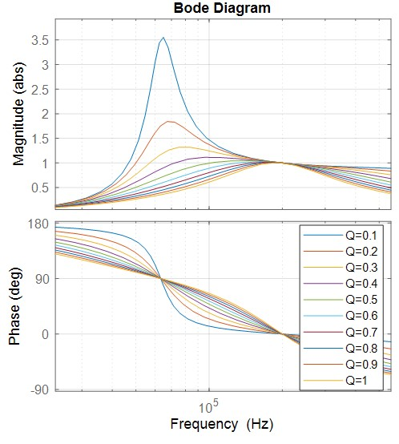
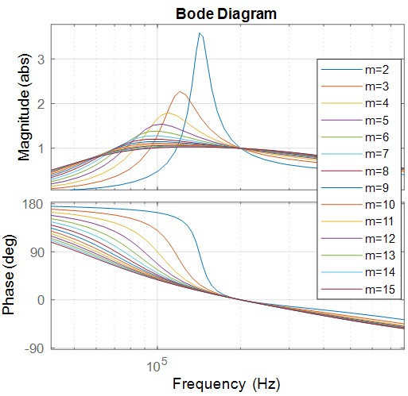

# Isolated Converters


A comprehensive collection of isolated DC-DC converter designs featuring complete simulation models, PCB layouts, and DSP control code implementations. This repository contains detailed design files for two major isolated converter topologies: Dual Active Bridge (DAB) and LLC Resonant converters.

## Overview

This project provides complete design resources for isolated power converters commonly used in high-power applications such as electric vehicle charging, renewable energy systems, and industrial power supplies. Each converter topology includes:

- **MATLAB/Simulink simulation models** for design verification and analysis
- **PCB design files** for hardware implementation
- **DSP control code** for real-time operation
- **Design documentation** and analysis figures
- **Component selection guidelines** and design scripts

## Project Structure

```
IsolatedConverters/
├── DABConverter/           # Dual Active Bridge Converter
│   ├── DSPCodes/          # Digital Signal Processor control code
│   ├── Figures/           # Design analysis and simulation results
│   ├── Images/            # Circuit diagrams and photos
│   ├── PCB/               # PCB design files and layouts
│   └── Simulations/       # MATLAB/Simulink simulation models
├── LLCConverter/          # LLC Resonant Converter
│   ├── DSPCodes/          # Digital Signal Processor control code
│   ├── Figures/           # Design analysis and simulation results
│   ├── Images/            # Circuit diagrams and photos
│   ├── PCB/               # PCB design files and layouts
│   └── Simulations/       # MATLAB/Simulink simulation models
│       ├── LLC_converter_design_script.m
│       ├── power_ResonantLLCConverter_FLi.slx
│       └── simulation_script.m
├── LICENSE.md
└── README.md
```

## Converter Topologies

### 1. Dual Active Bridge (DAB) Converter
The DAB converter is a bidirectional isolated DC-DC converter that provides:
- **Bidirectional power flow** capability
- **Soft switching** operation for high efficiency
- **Wide voltage regulation** range
- **Galvanic isolation** through high-frequency transformer
- **High power density** suitable for automotive and industrial applications

**Key Features:**
- Zero Voltage Switching (ZVS) operation
- Phase-shift control for power regulation
- Suitable for battery charging/discharging applications
- High efficiency across wide load range

### 2. LLC Resonant Converter
The LLC resonant converter offers:
- **High efficiency** through resonant operation
- **Soft switching** for both primary and secondary switches
- **Wide output voltage regulation** with frequency control
- **Excellent transformer utilization**
- **Low electromagnetic interference (EMI)**

**Key Features:**
- Zero Current Switching (ZCS) for rectifier diodes
- Zero Voltage Switching (ZVS) for primary switches
- Wide input voltage range capability
- Optimal for high-power density applications

## Technical Specifications

### Design Parameters (LLC Converter Example)
- **Input Voltage:** 750V (PFC output)
- **Output Voltage:** 55V
- **Output Power:** 10kW
- **Switching Frequency Range:** 50kHz - 250kHz
- **Efficiency Target:** >95%
- **Control Method:** Frequency modulation

### Simulation Environment
- **MATLAB/Simulink** for system-level modeling
- **Design-oriented analysis scripts** for component selection
- **Frequency domain analysis** for resonant tank design
- **Time domain simulation** for transient analysis

## Features

✅ **Complete Design Package**
- Full simulation models with detailed component models
- PCB layouts optimized for high-frequency operation
- DSP control algorithms with real-time implementation
- Design methodology and component selection guidelines

✅ **Industry-Standard Tools**
- MATLAB/Simulink simulation environment
- Professional PCB design files
- Embedded C code for DSP implementation
- Comprehensive documentation and analysis

✅ **Educational Value**
- Step-by-step design methodology
- Detailed analysis of converter operation
- Component selection rationale
- Performance optimization techniques

✅ **Research Applications**
- Baseline designs for research projects
- Validated simulation models for comparison
- Hardware implementation reference
- Control algorithm development platform

## Getting Started (LLC converter example)

### Prerequisites
- **MATLAB/Simulink** (R2020a or later recommended)
  - Simscape Power Systems Toolbox
  - Simulink Control Design Toolbox
- **PCB Design Software** (for viewing/modifying PCB files)
  - Altium Designer, KiCad, or similar
- **DSP Development Environment**
  - Code Composer Studio (for TI DSPs)
  - Or equivalent for your target DSP platform

### Quick Start Guide

1. **Clone the Repository**
   ```bash
   git clone https://github.com/YourUsername/IsolatedConverters.git
   cd IsolatedConverters
   ```

2. **Run LLC Converter Simulation**
   ```matlab
   % Open MATLAB and navigate to the project directory
   cd('LLCConverter/Simulations')
   
   % Run the design script
   run('LLC_converter_design_script.m')
   
   % Open the Simulink model
   open('power_ResonantLLCConverter_FLi.slx')
   ```

3. **Analyze Design Parameters**
   ```matlab
   % Run simulation script for performance analysis
   run('simulation_script.m')
   ```

### Usage Instructions

#### For Simulation Analysis
1. **Modify Design Parameters:** Edit the design scripts to change input/output specifications
2. **Component Selection:** Use the design-oriented analysis for optimal component values
3. **Performance Evaluation:** Run simulations to verify efficiency and regulation
4. **Sensitivity Analysis:** Vary parameters to understand design trade-offs

#### For Hardware Implementation
1. **Review PCB Layouts:** Examine the provided PCB designs for layout best practices
2. **Component Sourcing:** Use the bill of materials for component selection
3. **Assembly Guidelines:** Follow the assembly documentation for proper construction
4. **Testing Procedures:** Implement the provided test sequences for validation

#### For Control Development
1. **DSP Code Review:** Study the provided control algorithms
2. **Parameter Tuning:** Adjust control parameters for your specific application
3. **Real-time Implementation:** Port the code to your target DSP platform
4. **Closed-loop Testing:** Validate control performance with hardware-in-the-loop testing


### LLC Converter Performance
- **Efficiency:** >95% at full load
- **Regulation:** ±1% line and load regulation
- **Power Density:** Optimized for high-frequency operation
- **EMI Performance:** Low due to soft switching
#### LLC Converter Figures

The following key figures are provided for reference and are located in the `LLCConverter/Figures/` folder:
 





### DAB Converter Performance
- **Bidirectional Efficiency:** >94% in both directions
- **ZVS Range:** Wide ZVS operation range
- **Dynamic Response:** Fast transient response
- **Power Range:** Scalable from kW to MW applications

## Contributing

This is an archived project, but the designs and methodologies can serve as references for:
- Educational purposes in power electronics courses
- Research baseline for converter development
- Industrial design reference implementations
- Open-source hardware development

## Citing This Work

If you use these designs in your research or educational work, please cite:

```bibtex
@misc{li2024isolatedconverters,
  title={Isolated Converters: Complete Design Package for DAB and LLC Topologies},
  author={Li, Fulong},
  year={2024},
  publisher={GitHub},
  url={https://github.com/YourUsername/IsolatedConverters}
}
```

## Disclaimer

These designs are provided for educational and research purposes. Users should:
- Verify all calculations and simulations for their specific applications
- Conduct proper safety analysis before hardware implementation
- Follow applicable safety standards and regulations
- Perform thorough testing and validation

The author assumes no responsibility for any damages or injuries resulting from the use of these designs.

## Related Resources

### Recommended Reading
- "Resonant Power Converters" by Kazimierczuk
- "Power Electronics Handbook" by Rashid
- IEEE Transactions on Power Electronics (journal)

### Online Resources
- MATLAB Power Electronics Community
- IEEE Power Electronics Society
- Power Electronics Education Portal

## Version History

- **v1.0** (2024) - Initial release with complete LLC and DAB designs
- Archived status - No further updates planned

## Author

**[Fulong Li](https://fulongli.github.io/)** -  2024

## License

This project is licensed under the **Creative Commons Attribution 4.0 International License (CC BY 4.0)** - see the [LICENSE.md](LICENSE.md) file for details.

**Copyright © 2024 Fulong Li**

## Contact

For questions, collaborations, or technical discussions, please contact:
- **Email:** fulong.li@ieee.org
- **Website:** [https://fulongli.github.io/](https://fulongli.github.io/)